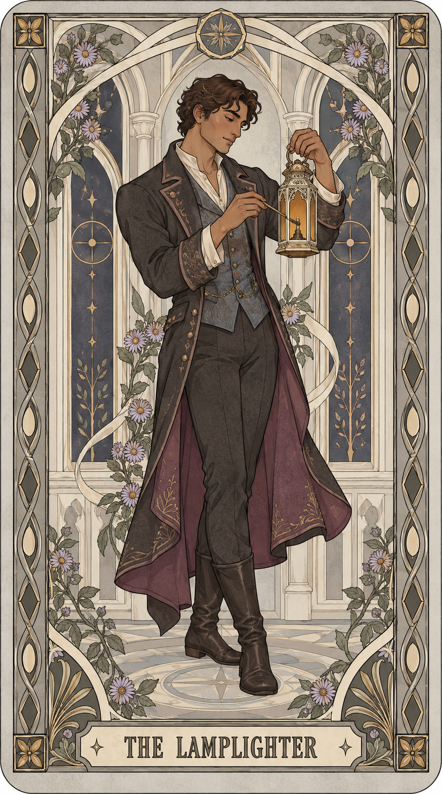
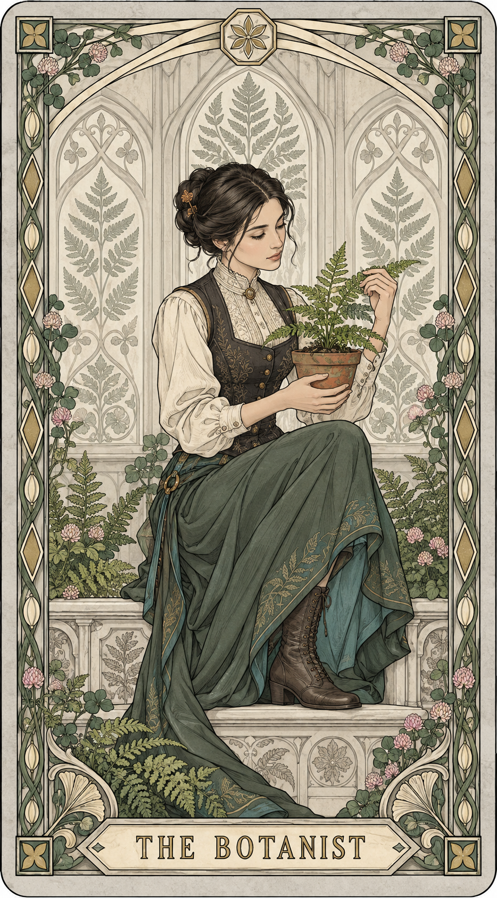
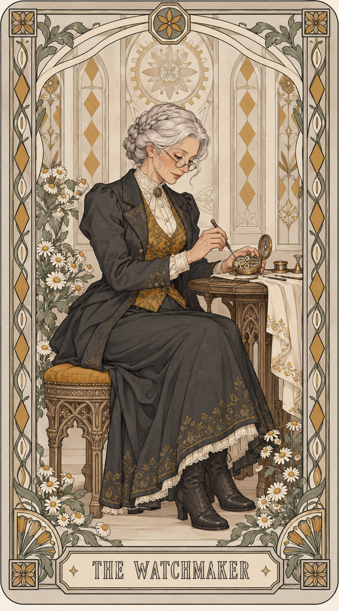
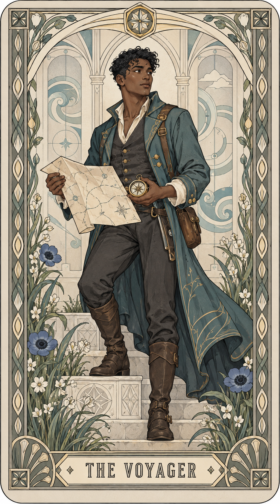

# Art Nouveau Tarot Skill

一套用于生成新艺术运动装饰风格塔罗牌的 Codex skill。支持个人主题、原创人物、已知角色和用户提供的肖像，并附带四张重新从纯文字生成的参考作品。

## 安装

下载仓库，把 `skills/artifact-template-art-nouveau-tarot` 整个文件夹放入自己的 Codex skills 目录（通常为 `~/.codex/skills`）。所有参考路径都相对于 skill 文件夹解析。重新打开会话后选择该 skill。

需要可用的图像生成工具。这个仓库不提供 API 密钥，也不安装图像生成服务。

## 使用

```text
使用 $artifact-template-art-nouveau-tarot，为一个喜欢植物的人生成一张塔罗牌。
```

```text
使用 $artifact-template-art-nouveau-tarot，为一个原创钟表匠角色生成一张塔罗牌。
```

```text
使用 $artifact-template-art-nouveau-tarot，输出适合分享的纯文字提示词，只保留一个输入位置。
```

默认自动使用内置参考图；明确要求纯文字生成时不传参考图。已知角色需要提供角色名与作品名，并自行确认拟发布或商业使用的权利。

## 参考预览

| 掌灯者 | 植物观察者 |
|---|---|
|  |  |

| 钟表匠 | 旅行者 |
|---|---|
|  |  |

这四张图分别用纯文字生成，没有使用旧图、第三方牌组照片或角色图片作为图像输入。人物、主题和边框编排均为本次新设计。原有本地模板不属于本公开仓库。

## 隐私与版权

检查范围和结果见 [AUDIT.md](AUDIT.md)，生成来源和权利边界见 [COPYRIGHT.md](COPYRIGHT.md)。

本仓库目前未附通用开源许可证；公开可见不等同于授予任意商用、再发布或其他授权。后续可由权利人选择许可证。AI 生成不等同于已经确认不侵犯第三方权利。

