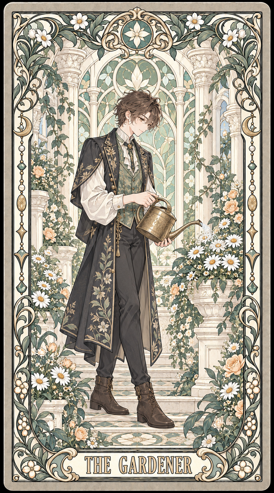

# Art Nouveau Tarot Skill

生成细腻动漫人物、明亮象牙白配色、繁密植物与层叠建筑装饰的塔罗牌。支持个人主题、原创人物、已有动漫角色与用户提供的肖像。

## v2 画风修正

这版修正了首个公开版本偏褐灰、人物更写实、装饰偏疏的问题。默认参考改为 **THE STARKEEPER**，另附 **THE GARDENER**，用于检查不同人物、动作和配色能否保持同一画风。只换角色不应导致整套绘画方式改变。

## 安装与使用

下载仓库，把 `skills/artifact-template-art-nouveau-tarot` 整个文件夹放入自己的 Codex skills 目录（通常为 `~/.codex/skills`）。重新打开会话后使用：

```text
使用 $artifact-template-art-nouveau-tarot，为一个喜欢园艺的人生成一张塔罗牌。
```

```text
使用 $artifact-template-art-nouveau-tarot，为芙莉莲（《葬送的芙莉莲》）生成一张塔罗牌。
```

只需一句话。默认自动传入内置参考图；若你选定另一张可访问的图片作为画风目标，它优先于默认参考。需要可用的图像生成工具；仓库不包含密钥或生成服务。

## 当前参考图

| 星图守护者 | 园艺者 |
|---|---|
|  |  |

两张样例均为新设计的虚构人物。主图使用用户选定的早期 AI 图片作为风格参考；第二张使用新主图。用户选定的输入图含已有动漫角色，未放入仓库。这次不是纯文字生成，也不声明完整版权链路已经核验。

## 检查与权利边界

检查记录见 [AUDIT.md](AUDIT.md)，来源与权利说明见 [COPYRIGHT.md](COPYRIGHT.md)。AI 生成、改换人物或公开可见均不等于第三方权利许可。已有角色的发布或商业使用需要另行确认。

仓库目前未附通用开源许可证。旧版参考图可在版本历史中找到，但当前 skill 不使用它们。图像生成有变化，模板不能保证每次完全相同。

